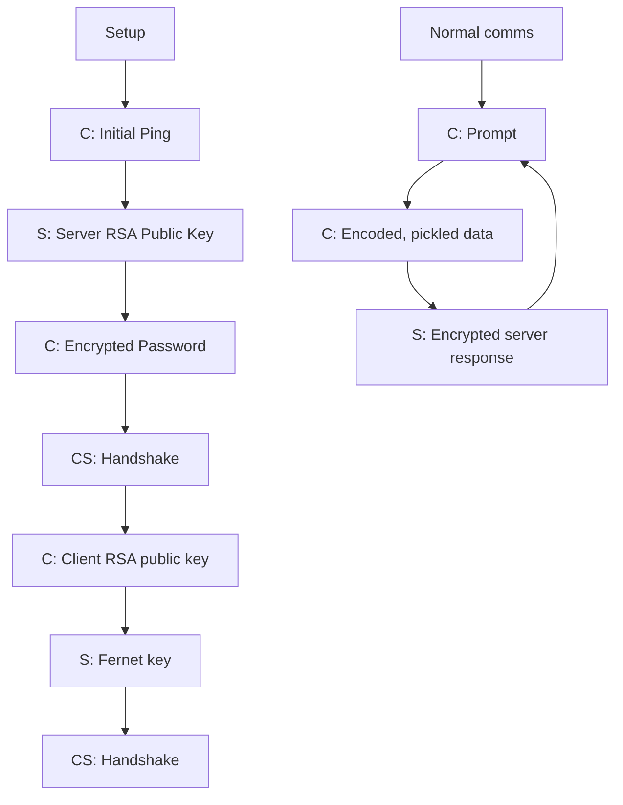

# WIP
## Safile
### SAfe FILEs

- A distributed server to access mission critical files. Cryptographically secure

- How does it work?

```mermaid
flowchart TD
    B[Setup]-->C;
    C[C: Initial Ping];
    D[S: Server RSA Public Key];
    C-->D;
    E[C: Encrypted Password];
    D-->E;
    F[CS: Handshake];
    E-->F;
    G[C: Client RSA public key];
    F-->G;
    H[S: Fernet key];
    G-->H;
    I[CS: Handshake];
    H-->I;


    A[Normal comms];
    L[C: Prompt];
    J[C: Encoded, pickled data];
    A-->L-->J;
    K[S: Encrypted server response];
    J-->K;
    K-->L;
```